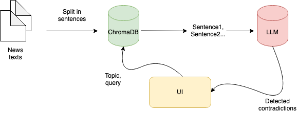

# Contradictions Finder

This is a project developed during the Bellingcat hackathon in Fall 2023 (or, rather, started 😀).

Team name: Bienenstich (Anastasiia Iurshina and Kristina Nedzvetskaia)

The project aims to find contradictions in multilingual textual data. The intended use case was finding contradictions in news data.

One can create a folder with text data (.txt at the moment). The texts are split into sentences and stored in a vector database (chromaDB atm), then one can provide a topic or a statement for which we will look for contradictions. Related statements will be found in the DB and then the pairs given to an LLM (currently OpenAI's API) to detect contradictions. After this, the detected contradictions with some context are displayed on the UI.

Note: the current demo works with a very limited dataset (10 short articles).

# How to run the project

Follow the backend's README.md to install and run the backend (be folder)

Follow the frontend's README.md to install and run the frontend (fe folder)

# TODOs

- [ ] Add more extensive preprocessing to remove too short sentences, errors of parsing, etc
- [ ] Decrease the amount of sentences fed into the DB (ideally only keep the sentences that make a "factual statement")
- [ ] A more efficient solution for the DB (chromaDB locally is not an adequate solution)
- [ ] Make the prompt and model names configurable through a config file.
- [ ] Try other embeddings for the vector database (probably OpenAI's would work best but then, we want in opensource)
- [ ] Switch to a fine-tuned open-source model, like Llama2 quantized and possibly fine-tuned on OpenAI's output
- [ ] Add callbacks from the backend to UI, scheduler for tasks
- [ ] Refine UI
- [ ] Detect and offer topics for the loaded data instead of entering a topic
- [ ] Add feedback loop from the user, to show if these are the contradictions or not (to help fine-tune the model)
